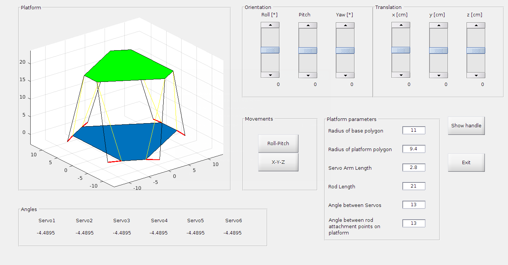

# Stewart Platform
This is a MATLAB application that demonstrates the inverse kinematics behind a Stewart Platform. 
Features (master):
* Calcualte geometry and movement of stewart platform autonomously
* Draw platform interactivly in a MATLAB GUI

In the "feature_devices" branch the GUI has the following additional features:

* Control of real Stewart Platform out of the MATLAB GUI
* Feeding the movement calculation with sensor data from an IMU, for example a smartphone over UDP

# Installation
## With Git
Clone the repository:
	
	git clone https://github.com/hbartle/Stewart_Platform.git

Add func/ to the Matlab path:

	(matlab) pathtool

The GUI is started by Matlab commandline or through GUIDE.
	
	(matlab) stewart_platform.m

or

	(matlab) guide stewart_platform.fig

## With Matlab-App
Download the packaged app from the Matlab App repositories and install it into MyApps.

# Screenshots

            
